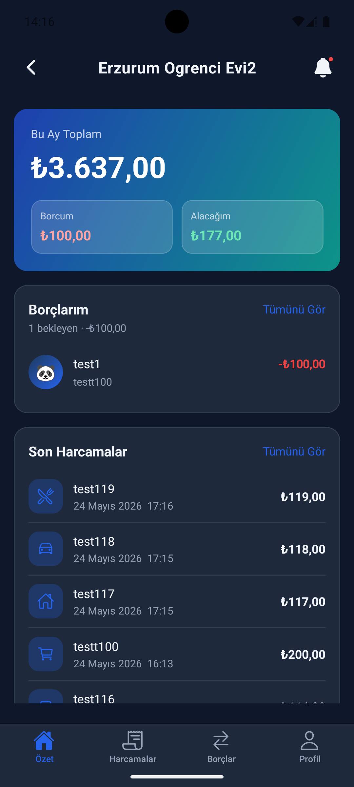
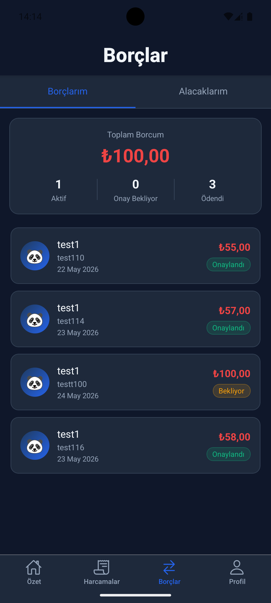

# HouseTab

> Shared expense tracking and debt management for roommates.

HouseTab lets people living together record shared expenses, automatically splits costs, tracks who owes whom, and settles debts with a single tap. An AI assistant generates monthly spending reports and flags unusual patterns.

<br/>

<!-- Replace with real screenshots -->
| Dashboard | Expenses | Debts | AI Report |
|-----------|----------|-------|-----------|
|  |  |  |  |

<br/>

## Features

**Expense management**
- Add, edit, and cancel shared expenses with full audit history
- Split costs equally across all members or select specific participants
- Every edit is versioned; cancellations require a reason and auto-resolve related debts

**Debt tracking**
- Debts are generated automatically when an expense is created
- Mark payments, confirm or reject them — both sides stay in sync
- Dashboard shows your pending debts and total owed at a glance

**AI assistant (Gemini 2.0)**
- Suggests expense categories from the title in real time
- Generates a natural-language monthly spending summary
- Detects anomalies in spending patterns

**Notifications**
- Push notifications via Firebase Cloud Messaging for new debts, payment confirmations, and monthly reports

**Other**
- English / Turkish interface
- Dark theme optimised for OLED screens
- Google Sign-In alongside email/password auth

<br/>

## Tech Stack

### Backend
| | |
|---|---|
| Language | Java 21 |
| Framework | Spring Boot 3.2.5 |
| Database | PostgreSQL (JPA / Hibernate) |
| Authentication | Firebase Admin SDK (token validation) |
| AI | Google Gemini 2.0 Flash via Vertex AI |
| Push notifications | Firebase Cloud Messaging |
| Deployment | Railway |

### Mobile
| | |
|---|---|
| Framework | React Native + Expo (Managed Workflow) |
| Language | TypeScript (strict) |
| Navigation | React Navigation 7 (Stack + Bottom Tab) |
| Server state | TanStack React Query v5 |
| Auth | `@react-native-firebase/auth` |
| Forms | React Hook Form + Yup |
| UI components | React Native Paper + Expo Vector Icons |
| Internationalisation | i18next (TR / EN) |

<br/>

## Architecture

```
┌─────────────────────────────────────┐
│          React Native App           │
│  React Query · Firebase Auth SDK    │
└────────────────┬────────────────────┘
                 │  Bearer <Firebase ID Token>
                 ▼
┌─────────────────────────────────────┐
│         Spring Boot REST API        │
│                                     │
│  FirebaseTokenFilter                │
│    └─ validates token with          │
│       Firebase Admin SDK            │
│                                     │
│  Controller → Service → Repository  │
│                                     │
│  Domains:                           │
│    user · home · expense · debt     │
│    category · analytics · ai        │
│    notification · audit · settings  │
└──────┬──────────────┬───────────────┘
       │              │
       ▼              ▼
  PostgreSQL     Gemini 2.0 / FCM
```

**Key design decisions**

- Expenses are never deleted — only cancelled (`status = CANCELLED`). Every edit creates an `ExpenseVersion` snapshot.
- Debts are auto-generated on expense creation and auto-resolved on cancellation.
- A home has exactly one `OWNER`. The owner must transfer the role before leaving.
- All endpoints return a unified `ApiResponse<T>` wrapper; errors go through `GlobalExceptionHandler`.

<br/>

## Getting Started

### Prerequisites

- Java 21
- Maven 3.9+
- Node.js 18+
- PostgreSQL 15+
- Firebase project with Authentication enabled
- (Optional) Google Cloud project with Vertex AI enabled for AI features

### Backend

**1. Clone and configure**

```bash
git clone https://github.com/your-username/housetab.git
cd housetab/SharedHomeFinance
```

Create `src/main/resources/application-local.properties` (gitignored):

```properties
spring.datasource.url=jdbc:postgresql://localhost:5432/housetab
spring.datasource.username=YOUR_DB_USER
spring.datasource.password=YOUR_DB_PASSWORD

gemini.api.key=YOUR_GEMINI_API_KEY
```

Place your Firebase service account JSON at `src/main/resources/serviceAccountKey.json`, or set the environment variable:

```bash
export FIREBASE_SERVICE_ACCOUNT_JSON='{ ...json content... }'
```

**2. Run**

```bash
./mvnw spring-boot:run
# API available at http://localhost:8080/api
```

**3. Test**

```bash
./mvnw test
```

### Mobile

**1. Install dependencies**

```bash
cd housetab/SharedHomeFinanceMobile
npm install
```

**2. Configure API URL**

Edit `app.json`:

```json
"extra": {
  "apiUrl": "http://10.0.2.2:8080/api"
}
```

Use `10.0.2.2` for Android emulator, `localhost` for iOS simulator, or your Railway URL for production.

**3. Run**

```bash
npm start          # Start Expo dev server
npm run android    # Open on Android emulator
npm run ios        # Open on iOS simulator
```

<br/>

## API Overview

All endpoints require `Authorization: Bearer <Firebase ID Token>` unless noted.

| Method | Path | Description |
|--------|------|-------------|
| `POST` | `/api/users/register` | Register or log in (upsert by Firebase UID) |
| `GET` | `/api/homes` | List homes the current user belongs to |
| `POST` | `/api/homes` | Create a new home |
| `GET` | `/api/homes/{id}/expenses` | Paginated expense list |
| `POST` | `/api/homes/{id}/expenses` | Add an expense |
| `PUT` | `/api/homes/{id}/expenses/{eid}` | Edit an expense (creates version snapshot) |
| `POST` | `/api/homes/{id}/expenses/{eid}/cancel` | Cancel an expense |
| `GET` | `/api/homes/{id}/debts/my` | Debts the current user owes |
| `GET` | `/api/homes/{id}/debts/credits` | Debts owed to the current user |
| `POST` | `/api/homes/{id}/debts/{did}/mark-as-paid` | Borrower marks debt as paid |
| `POST` | `/api/homes/{id}/debts/{did}/confirm` | Creditor confirms payment |
| `GET` | `/api/homes/{id}/analytics/monthly` | Monthly totals |
| `GET` | `/api/homes/{id}/analytics/personal` | Current user's total debt / credit |
| `POST` | `/api/ai/suggest-category` | AI category suggestion |
| `POST` | `/api/ai/monthly-report` | AI monthly narrative report |

<br/>

## Project Structure

```
housetab/
├── SharedHomeFinance/               # Spring Boot backend
│   └── src/main/java/.../
│       ├── domain/
│       │   ├── user/
│       │   ├── home/
│       │   ├── expense/
│       │   ├── debt/
│       │   ├── category/
│       │   ├── analytics/
│       │   ├── notification/
│       │   └── audit/
│       ├── config/                  # Firebase, Security, CORS
│       ├── common/                  # ApiResponse, exceptions, GlobalExceptionHandler
│       └── ai/                      # GeminiAIService
│
└── SharedHomeFinanceMobile/         # React Native app
    └── src/
        ├── screens/
        │   ├── auth/
        │   ├── home/
        │   ├── expense/
        │   ├── debt/
        │   ├── analytics/
        │   └── profile/
        ├── services/                # All API calls (Axios)
        ├── context/                 # AuthContext, HomeContext, ThemeContext
        ├── navigation/
        ├── i18n/                    # TR / EN translations
        └── theme/
```

<br/>

## License

MIT
